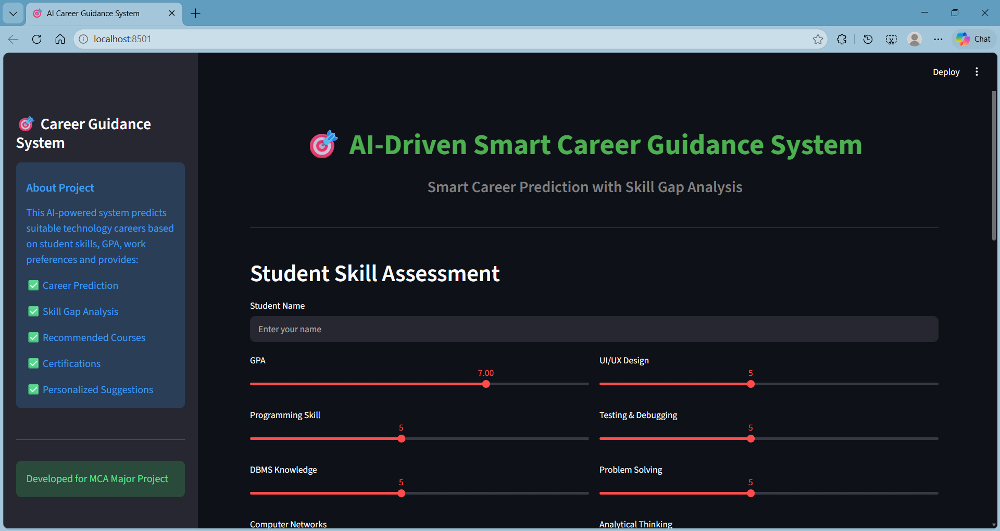
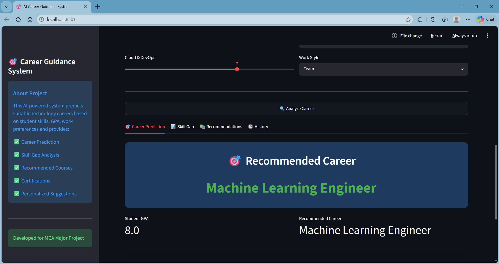
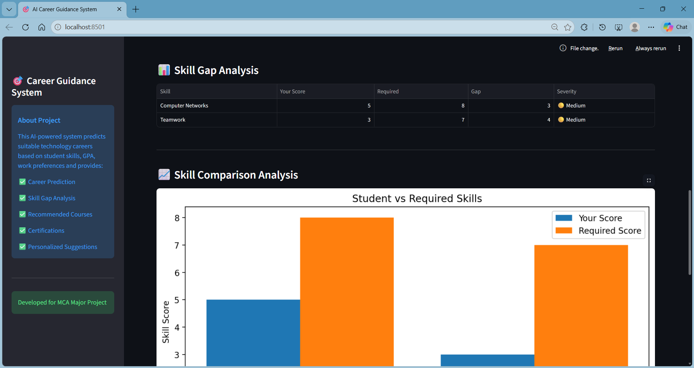
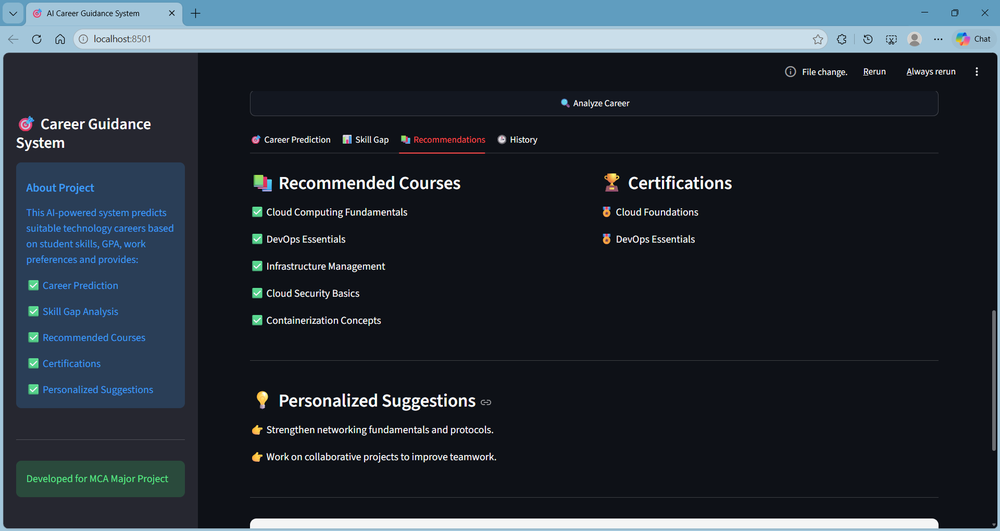
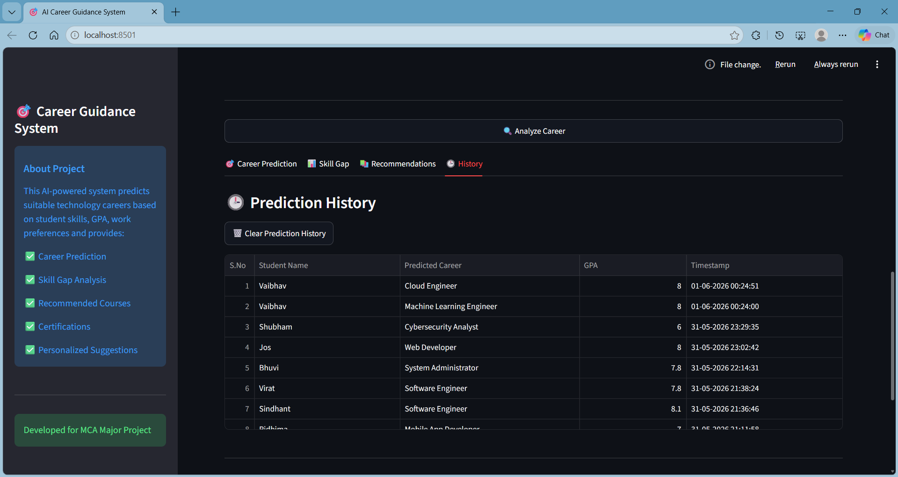

# 🎯 AI-Driven Smart Career Guidance System

An intelligent machine learning-based web application that predicts suitable technology career paths for students based on their academic performance, technical skills, and work preferences. The system also performs **Skill Gap Analysis** and provides **personalized recommendations** including courses, certifications, and improvement suggestions.

---

## 🚀 Live Demo

🔗 [Launch Application](https://ai-career-guidance-system-a.streamlit.app)

---

## 📌 Project Overview

Choosing the right career path is one of the biggest challenges for students. This project helps students identify the most suitable technology career domain using Machine Learning.

The system analyzes:

- Academic performance (GPA)
- Technical skills
- Soft skills
- Work preferences
- Problem-solving ability

Based on these inputs, the system predicts the most appropriate career path and provides guidance for skill improvement.

---

## ✨ Features

### 🎯 Career Prediction

Predicts suitable career roles such as:

- Data Scientist
- Machine Learning Engineer
- Software Developer
- Web Developer
- App Developer
- Cybersecurity Analyst
- UI/UX Designer
- Cloud Engineer
- Database Administrator

### 📊 Skill Gap Analysis

Compares student skill levels with required career skills and identifies gaps.

### 📈 Skill Comparison Graph

Visual representation of:

- Student skill score
- Required skill score

### 📚 Course Recommendations

Suggests relevant learning resources based on predicted career.

### 🏆 Certification Suggestions

Recommends certifications for career improvement.

### 💡 Personalized Suggestions

Provides customized suggestions to improve weak areas.

### 🕒 Prediction History

Stores previous predictions using SQLite database.

### 🗑️ Clear History Option

Allows clearing prediction history.

---

## 🛠️ Tech Stack

### Programming Language

- Python

### Libraries & Frameworks

- Streamlit
- Pandas
- NumPy
- Matplotlib
- Scikit-learn
- Joblib
- SQLite3

### Machine Learning

- Random Forest Classifier

---

## 📂 Project Structure

```text
career_guidance_system/
│── app.py
│── requirements.txt
│── README.md
│── .gitignore
│
├── assets/
│   └── screenshots/
│       ├── home_page.png
│       ├── career_prediction.png
│       ├── skill_gap.png
│       ├── recommendations.png
│       └── history.png
│
├── data/
│   ├── synthetic_dataset.csv
│   └── career_skills.json
│
├── database/
│   └── db_manager.py
│
├── models/
│   ├── career_model.pkl
│   ├── scaler.pkl
│   ├── label_encoder.pkl
│   ├── feature_columns.pkl
│   ├── work_style_encoder.pkl
│   └── work_type_encoder.pkl
│
├── scripts/
│   ├── train_model.py
│   ├── generate_dataset.py
│   └── check_db.py
│
├── tests/
│   ├── test_prediction.py
│   ├── test_skill_gap.py
│   ├── test_recommendation.py
│   └── test_database.py
│
└── utils/
    ├── predict.py
    ├── skill_gap.py
    └── recommendation.py
```

---

## ⚙️ Installation & Setup

### 1️⃣ Clone Repository

```bash
git clone https://github.com/AayushAggarwal06/ai-career-guidance-system.git
```

### 2️⃣ Open Project Folder

```bash
cd ai-career-guidance-system
```

### 3️⃣ Create Virtual Environment

```bash
python -m venv .venv
```

### 4️⃣ Activate Virtual Environment

#### Windows

```bash
.venv\Scripts\activate
```

### 5️⃣ Install Dependencies

```bash
pip install -r requirements.txt
```

### 6️⃣ Run Application

```bash
streamlit run app.py
```

---

## 📸 Project Screenshots

### Home Page



### Career Prediction



### Skill Gap Analysis



### Recommendations



### Prediction History



---

## 🎓 Academic Information

**Project Title:**
AI-Driven Smart Career Guidance System with Skill Gap Analysis

**Course:**
Master of Computer Applications (MCA)

**University:**
Guru Jambheshwar University of Science & Technology, Hisar

**Academic Year:**
Final Year Major Project

---

## 🔮 Future Scope

- Real-time career market analysis
- AI chatbot integration
- Resume analysis feature
- Job recommendation system
- Online learning platform integration

---

## 👨‍💻 Author

**Aayush Aggarwal**<br>
MCA Final Year Student <br>
Guru Jambheshwar University of Science & Technology

GitHub:
https://github.com/AayushAggarwal06
